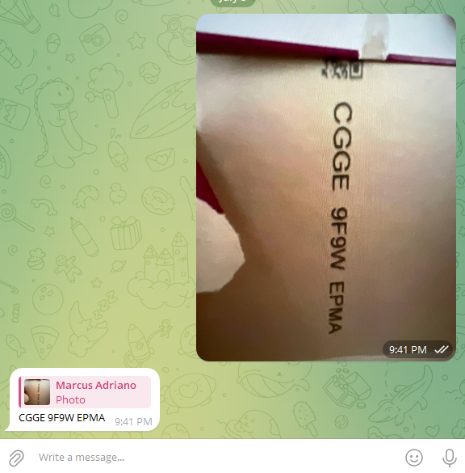

# Getting Started

This is a very simple example of usage [Spring-AI](https://docs.spring.io/spring-ai/reference/getting-started.html).

## Requirements

- Java
- Telegram Bot Token (You can get it from [BotFather](https://t.me/BotFather))
- OpenAI API Key 

### Env Variables

```bash
export TELEGRAM_TOKEN
```

```bash
export SPRING_AI_OPENAI_API_KEY
```

## Usage

Simple: take a photo of your Dolce Gusto box and send it to the bot. The bot will tell you the characters.

## Example

